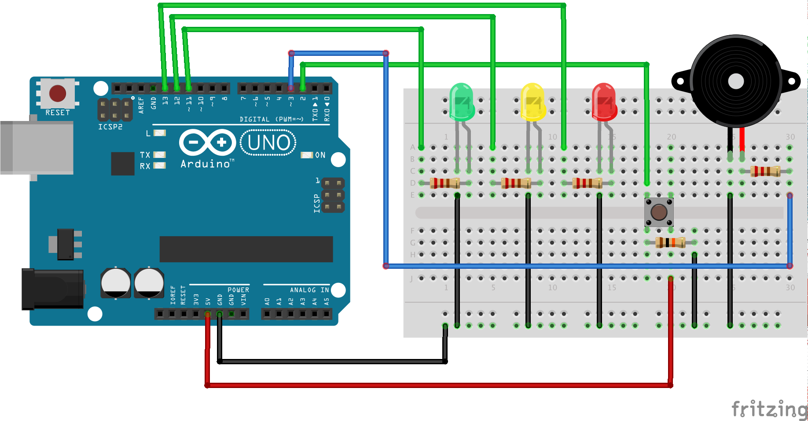

## Traffic light robot

This example illustrates the following:

+ How to define your own hardware driver - in this case a buzzer
+ Defining a class that implements a state machine to clean up the code (using the state machine gem)
+ Adding unit tests for your class



### Defining your own driver

I wanted to add a piezo buzzer to my circuit, but alas there was no standard driver for the component in the framework (at least at that time). I expected this would happen often, so this was one of the first things I investigated when checking out Artoo.

I could not find any documentation or help on how to do this, but it became clear by looking at the Artoo source code that when you define a device `device :buzzer, driver: driver_name, pin: pin` it will attempt to require the driver `artoo/drivers/#{driver_name}` in the process of initialization.

I obliged by adding an `artoo/drivers` folder to my `lib` folder and adding the `lib` folder to my load path using the following statement in my example script:

```
$LOAD_PATH << "#{Dir.pwd}/lib"
```
It feels like a bit of a hack, but hey at least all my driver files are in a sensible place and I can extend the framework to support any hardware I want 
